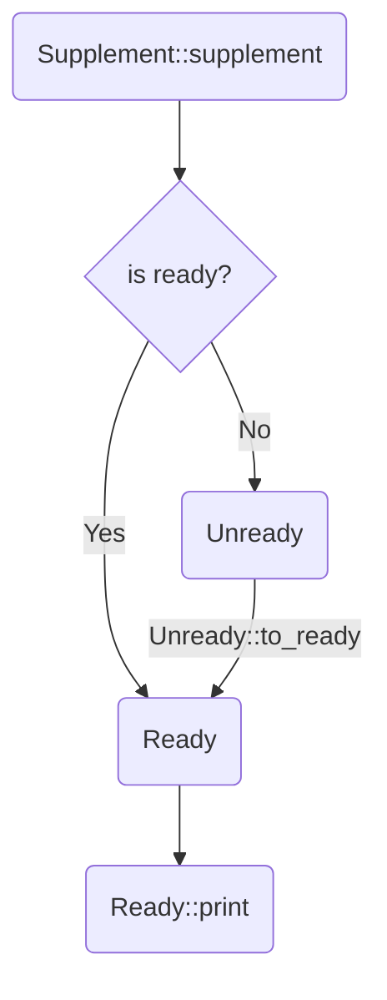

# supplement-example

This example demonstrates the steps to use `supplement` in your CLI app.

The CLI definition here mimics our beloved version control tool `git`, so in this document, let's call our toy app `qit`.

1. Derive `Supplement` for your clap definition
    - [derive.rs](derive.rs)
2. Implement the completion logic
    - [derive.rs](derive.rs)
3. Compile the binary
    - `cargo build`
4. Put a simple shell script in place to tell the shell how to use your binary
    - [install.sh](install.sh) and [shell/](shell)

## Derive `Supplement`
In [derive.rs](derive.rs) you can find a small clap definition that looks like a super simplified `git`. It contains two subcommands: `checkout` and `log`, and some arguments and flags.

## Implement the completion logic
The program has two modes:
- **Parse mode** - `cargo run -- [anything else]`. Parse the command line argument into a clap object and print it.
- **Completion mode** - `cargo run -- [zsh/bash/fish] qit ...`. Run the completion function for a specific shell.
    + Note that the whitespace is significant: `cargo run -- fish check` means `qit check<TAB>`, while `cargo run -- fish check ''` means `qit check <TAB>`

Obviously the **Completion Mode** is our main focus, so let's look into it deeper.

```rust
let (seen, grp) = Git::supplement(args).unwrap();
let ready = match grp {
    CompletionGroup::Ready(r) => {
        // The easy path. No custom logic needed.
        // e.g. Completing a subcommand or flag, like `git chec<TAB>`
        // or completing something with candidate values, like `ls --color=<TAB>`
        r
    }
    CompletionGroup::Unready { unready, id, value } => {
        let comps: Vec<Completion> = handle_comp(id, &seen, &value);
        unready.to_ready(comps)
    }
};
ready.print(shell, &mut stdout()).unwrap();
```

The function `Git::supplement` returns a `Result<(Seen, CompletionGroup)>`.
`Seen` records everything seen while parsing the command, which your completion may later depend on.
`CompletionGroup` is an enum that has two variants: `Ready` and `Unready`.

### Ready
`Ready` is the easy path. No custom logic needed. You should just call `Ready::print` and end the process.

### Unready
`Unready` is the hard path. Your custom logic should go here. You'll have the seen values, the ID of the element to complete (flag or argument), and its current value in the command line (possibly `''`).

For example, if you do `cargo run -- fish checkout file1 file2 fi`, the seen values will contain `file1` and `file2`, the id will be `id!(Git.sub Sub.Checkout.files)`, and the value will be `"fi"`.

You have to convert it to a `Ready` object to print it, hence the `to_ready` function, and the input is a `Vec<Completion>`.
This is when `supplement` hands over the control to *YOU*. You're the only one who knows the invariants and needs of your app.
Only *YOU* can compute the vector based on the seen values, id, value, and whatever else you're interested in.

In [derive.rs](derive.rs) I wrote a function `handle_comp` for the custom logic.
For example, `id!(Git.git_dir)` should use default completion, and `id!(Git.sub Sub.Checkout.files)` should be completed with a list of commit hash.

### Ready::print
The final step. Tell it which shell to use and fire!



### Seen
Sometimes the completion depends on the CLI context, e.g. knowing the flag value `--git-dir` on CLI.

`supplement` generates a bunch of helper function, which make accessing the context type safe.
For example, when you're completing an argument for `checkout`,
you can only get the root flags/args (`--git-dir`) and the flags/args of `checkout` (`FILE_OR_COMMIT` and `FILES`).
You can **NEVER** get anything from `log` (e.g. `--pretty`).

Refer to this code in [derive.rs](derive.rs):

```rs
match id {
    // ...

    id!(Git.sub(root_accessor) Sub.Checkout.files(chk_accessor)) => {
        let _git_dir: Option<&Path> = root_accessor.git_dir(seen);
        let prev1: Option<&str> = chk_accessor.file_or_commit(seen);
        let prev2 = chk_accessor.files(seen); // impl Iterator<Item = &Path>

        // ...
    }
}
```

The two *"accessor"* objects correspond to two layers of command structures.
Because they are structure-aware, we can get the strongly-typed values by calling their functions, e.g. `chk_accessor.files()` for argument `FILES`.

## Install
If you like, you can actually install this toy app `qit` to your system along with its completion.

The [install.sh](install.sh) will ask for a `usr` path from you and try to copy the binary there, along with the completion script for `zsh`, `bash`, or `fish`.

After that, you can open a new shell and play with it.

```sh
qit <TAB> # checkout log
qit -<TAB> # --git-dir
qit checkout <TAB> # some commit hash & files
```

The shell completion scripts can be found in [shell/](shell). They will be moved to the corresponding path in your system:
- `qit.fish` -> `~/.config/fish/completions/qit.fish`
- `qit.bash` -> `$USR_PATH/share/bash-completion/completions/qit`
- `qit.zsh` -> `$USR_PATH/local/share/zsh/site-functions/_qit`
    + Note that if you use `oh-my-zsh`, you can also put it at `~/.oh-my-zsh/completions/_qit`.


These files are tiny because the goal of `supplement` is to let you write as little shell as possible.
So it should be easy to tweak them to fit your needs -- but don't overdo it and defeat the purpose of `supplement` 😞
