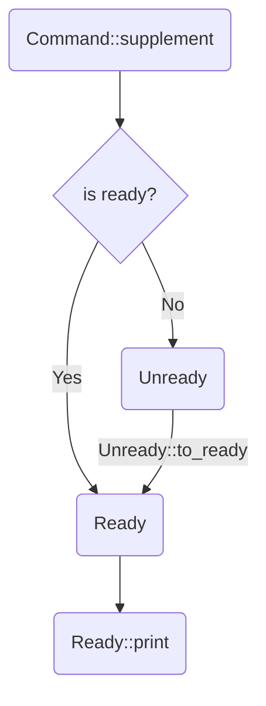

# supplement-example

This example will demonstrate the steps to use `supplement` in your CLI app.

The CLI definition here mimics our beloved version control tool `git`, so in this document, let's call our toy app `qit`.

1. Have a `clap` definition
    - [src/args.rs](src/args.rs)
2. Generate the `supplement` definition (preferably in `build.rs`)
    - [build.rs](build.rs) and [Cargo.toml](Cargo.toml)
3. Import and use the generated code
    - [src/main.rs](src/main.rs)
4. Compile the binary
    - `cargo build`
5. Put a simple shell script in place to tell the shell how to use your binary
    - [install.sh](install.sh) and [shell/](shell)

## The clap definition
In [src/args.rs](src/args.rs) you can find a small clap definition that looks like a super simplified `git`. It contains two subcommands: `checkout` and `log`, and some arguments and flags.

## Generate the `supplement` definition
In theory, you can call the generate function anywhere you like. In this example, we call it in [build.rs](build.rs), which generates a file `$OUT_DIR/definition.rs`.

NOTE that you should also add the dependency in the `build-dependencies` section of [Cargo.toml](Cargo.toml), because `build.rs` doesn't use the normal dependencies.
```toml
[build-dependencies]
supplement = "0.1"
```

## Import and use the generated code
In [src/main.rs](src/main.rs), import the generated file as a module. The program has three modes:
- **Completion mode** - `cargo run -- [zsh/bash/fish] qit ...`. Run the completion function for a specific shell.
    + Note that the whitespace is significant: `cargo run -- fish check` means `qit check<TAB>`, while `cargo run -- fish check ''` means `qit check <TAB>`
- **Generate mode** - `cargo run -- generate`. Generate the supplement definition and print to stdout.
- **Parse mode** - `cargo run -- [anything else]`. Parse the command line argument into a clap object and print it.

Obviously the **Completion Mode** is our main focus, so let's look into it deeper.

```rust
let (history, grp) = def::CMD.supplement(args).unwrap();
let ready = match grp {
    CompletionGroup::Ready(r) => {
        // The easy path. No custom logic needed.
        // e.g. Completing a subcommand or flag, like `git chec<TAB>`
        // or completing something with candidate values, like `ls --color=<TAB>`
        r
    }
    CompletionGroup::Unready { unready, id, value } => {
        let comps = handle_comp(history, id, &value);
        unready.to_ready(comps)
    }
};
ready.print(shell, &mut stdout()).unwrap();
```

The function `def::CMD.supplement` returns a `Result<(History, CompletionGroup)>`.
`History` records everything seen while parsing the command, which your completion may later depend on.
`CompletionGroup` is an enum that has two variants: `Ready` and `Unready`.

### Ready
`Ready` is the easy path. No custom logic needed. You should just call `Ready::print` and end the process.

### Unready
`Unready` is the hard path. Your custom logic should go here. You'll have the history, the id of the last seen element (flag or argument), and the value in the command line (possibly `''`).

For example, if you do `cargo run -- fish checkout file1 file2 ''`, the history will contain `file1` and `file2`, the id will be `ID::Checkout(def::checkout::ID::File)`, and the value will be `''`.

You have to convert it to a `Ready` object to print it, hence the `to_ready` function, and the input is a `Vec<Completion>`.
This is when `supplement` hands over the control to *YOU*. You're the only one who knows the invariants and needs of your app.
Only *YOU* can compute the vector based on the history, id, value, and anything else you're interested in.

In [src/main.rs](src/main.rs) I wrote a function `handle_comp` for this custom logic.
For example, `id!(git_dir)` should simply be completed with files, and `id!(checkout files)` should be completed with a list of commit hash.

### Ready::print
The final step. Tell it which shell you're using and fire!



## Install
If you like, you can actually install this toy app `qit` to your system along with its completion.

The [install.sh](install.sh) will ask for a `usr` path from you and try to copy the binary there, along with the completion script for `zsh`, `bash`, or `fish`.

After that, you can open a new shell and play with it.

```sh
qit <TAB> # checkout log
qit -<TAB> # --git-dir
qit checkout <TAB> # some commit hash & files
```

The shell completion scripts can be found in [shell/](shell). They will be moved to the corresponding path in your system:
- `qit.fish` -> `~/.config/fish/completions/qit.fish`
- `qit.bash` -> `$USR_PATH/share/bash-completion/completions/qit`
- `qit.zsh` -> `$USR_PATH/local/share/zsh/site-functions/_qit`
    + Note that if you use `oh-my-zsh`, you can also put it at `~/.oh-my-zsh/completions/_qit`.


These files are tiny because the goal of `supplement` is to let you write as little shell as possible.
So it should be easy to tweak them to fit your needs -- but don't overdo it and defeat the purpose of `supplement` 😞
